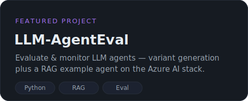
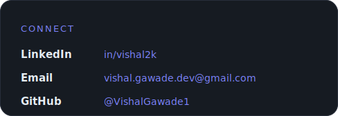

  

  

<!-- Live, auto-updating contribution visuals -->

<picture>
  <source media="(prefers-color-scheme: dark)" srcset="https://raw.githubusercontent.com/VishalGawade1/VishalGawade1/output/github-contribution-grid-snake-dark.svg" />
  <source media="(prefers-color-scheme: light)" srcset="https://raw.githubusercontent.com/VishalGawade1/VishalGawade1/output/github-contribution-grid-snake.svg" />
  
</picture>

 

  <a href="https://linkedin.com/in/vishal2k">LinkedIn</a> &nbsp;·&nbsp;
  <a href="mailto:vishal.gawade.dev@gmail.com">vishal.gawade.dev@gmail.com</a> &nbsp;·&nbsp;
  <a href="https://github.com/VishalGawade1">@VishalGawade1</a>

